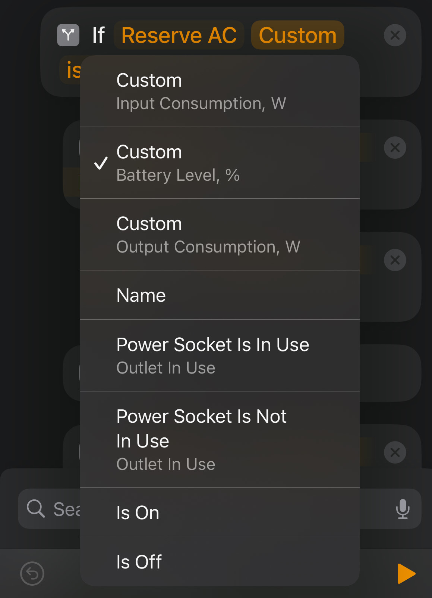

<span align="center">

# homebridge-ecoflow

[](https://www.npmjs.com/package/@pietrolubini/homebridge-ecoflow)
[](https://github.com/pietrolubini/homebridge-ecoflow/blob/main/LICENSE)

</span>

`homebridge-ecoflow` is a plugin for homebridge which allows you to control EcoFlow devices!
The goal is to add HomeKit support to EcoFlow devices and make them fully controllable from the native HomeKit iOS app and Siri.

> Feedback and contribution is helpful and will improve the plugin!

> If your device is not supported please create a request and specify the device model and type. Additional collaboration may be required to perform testing of new device.

## Features

- Integrates EcoFlow devices into HomeKit
- Fully customizable HomeKit accessories
- HomeKit automations for your EcoFlow devices

## Supported device types

- Delta 2
- Delta 2 Max

For a full list of devices that could be potentially added check [here](https://developer-eu.ecoflow.com/us/document/introduction)

## Installation

If you are new to homebridge, please first read the homebridge [documentation](https://github.com/homebridge/homebridge#readme). If you are running on a Raspberry, you will find a tutorial in the [homebridge wiki](https://github.com/homebridge/homebridge/wiki/Install-Homebridge-on-Raspbian).

Install homebridge-ecoflow:

```sh
sudo npm install -g @pietrolubini/homebridge-ecoflow
```

## Configuration

Add the `EcoFlowHomebridge` platform in `config.json` in your home directory inside `.homebridge`.

Add your devices in the `devices` array.

Example configuration:

```js
{
  "platforms": [
    {
      "devices": [
        {
          "name": "Battery",
          "model": "Delta 2 Max",
          "serialNumber": "R123ABCDEGHI321",
          "accessKey": "IROcwtlejtHj4qY4MRgCZW0CxoCdPVs3",
          "secretKey": "yBwYgZWqNnAlULKmF1Qrydy2Iheexj22"
        }
      ],
      "platform": "EcoFlowHomebridge",
    }
  ]
}
```

### Battery-specific Configuration

If `devices`.`model` is one of [`Delta 2`, `Delta 2 Max`] it is possible to set turn on/off custom characteristics:

- Input Consumption, W
- Output Consumption, W
- Battery Level, %

```js
{
  ...
  "devices": [
    {
      ...,
      "model": "Delta 2 Max",
      "battery": {
        "customCharacteristics": [
          "Input Consumption, W",
          "Output Consumption, W",
          "Battery Level, %"
        ]
      }
    }
  ],
}
```

The characteristics could be used as conditions in HomeKit Automation that uses Shortcuts:



### AccessKey and SecretKey

For the plugin to work EcoFlow account's `AccessKey` and `SecretKey` is required. To retrieve them

- Register on [EcoFlow IoT Developer Platform](https://developer-eu.ecoflow.com/)
- Wait until your request will be approved
- Generate `AccessKey`/`SecretKey` pair [here](https://developer-eu.ecoflow.com/us/security)

## Troubleshooting

### Debug

If you have any issues with the plugin or device services then you can run homebridge in debug mode, which will provide some additional information. This might be useful for debugging issues.

Homebridge debug mode:

```sh
homebridge -D
```

Deep debug log, add the following to your config.json:

```json
"deepDebugLog": true
```

This will enable additional extra log which might be helpful to debug all kind of issues.
