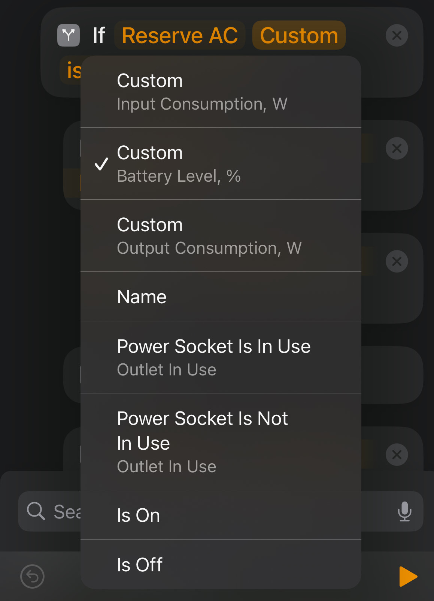

<span align="center">

# @pietrolubini/homebridge-ecoflow

[](https://www.npmjs.com/package/@pietrolubini/homebridge-ecoflow/v/latest)
[](https://www.npmjs.com/package/@pietrolubini/homebridge-ecoflow/v/beta)
[](https://www.npmjs.com/package/@pietrolubini/homebridge-ecoflow)
[](https://github.com/pietrolubini/homebridge-ecoflow/actions/workflows/build.yml)
[](https://github.com/pietrolubini/homebridge-ecoflow/blob/main/LICENSE)
[](https://github.com/homebridge/homebridge/wiki/Verified-Plugins)
[](https://commerce.coinbase.com/checkout/d56df2da-7609-41a3-af91-289cb6ec4d9b)

</span>

`@pietrolubini/homebridge-ecoflow` is a plugin for homebridge which allows you to control EcoFlow devices!
The goal is to add HomeKit support to EcoFlow devices and make them fully controllable from the native HomeKit iOS app and Siri.

> Feedback and contribution is helpful and will improve the plugin!

> If your device is not supported please create a request and specify the device model and type. Additional collaboration may be required to perform testing of new device.

## Features

- Integrates EcoFlow devices into HomeKit
- Fully customizable HomeKit accessories
- HomeKit automations for your EcoFlow devices

## Supported Device Types

- [Delta 2](#delta-2)
- [Delta 2 Max](#delta-2-max)
- [PowerStream Micro-inverter](#powerstream-micro-inverter)

For a full list of devices that could be potentially added check [here](https://developer-eu.ecoflow.com/us/document/introduction)

## Installation

If you are new to homebridge, please first read the homebridge [documentation](https://github.com/homebridge/homebridge#readme). If you are running on a Raspberry, you will find a tutorial in the [homebridge wiki](https://github.com/homebridge/homebridge/wiki/Install-Homebridge-on-Raspbian).

Install homebridge-ecoflow:

```sh
sudo npm install -g @pietrolubini/homebridge-ecoflow
```

## Configuration

Add the `EcoFlowHomebridge` platform in `config.json` in your home directory inside `.homebridge`. Add your devices in the `devices` array. Example of configuration:

```json
{
  "platforms": [
    {
      "devices": [
        {
          "disabled": false,
          "name": "Battery",
          "model": "Delta 2 Max",
          "serialNumber": "R123ABCDEGHI321",
          "location": "EU",
          "accessKey": "IROcwtlejtHj4qY4MRgCZW0CxoCdPVs3",
          "secretKey": "yBwYgZWqNnAlULKmF1Qrydy2Iheexj22"
        }
      ],
      "name": "Homebridge EcoFlow",
      "platform": "EcoFlowHomebridge"
    }
  ]
}
```

### AccessKey and SecretKey

For the plugin to work EcoFlow account's `AccessKey` and `SecretKey` is required. To retrieve them

- Register on [EcoFlow IoT Developer Platform](https://developer-eu.ecoflow.com/)
- Wait until your request will be approved
- Generate `AccessKey`/`SecretKey` pair [here](https://developer-eu.ecoflow.com/us/security)

### Simulate Accessory

It is possible to simulate accessory by adding `simulate` property to device's configuration (`accessKey` and `secretKey` could contain mock values).
Quota is sent every 10 seconds with random values in this mode.

> 🛈 Each simulated device should have fake unique `serialNumber`, `accessKey` and `secretKey`

```json
{
  "platforms": [
    {
      "devices": [
        {
          "disabled": false,
          "name": "Battery",
          "model": "Delta 2 Max",
          "serialNumber": "R123ABCDEGHI321",
          "accessKey": "key1",
          "secretKey": "key2",
          "simulate": true
        }
      ],
      "name": "Homebridge EcoFlow",
      "platform": "EcoFlowHomebridge"
    }
  ]
}
```

## Supported Devices

### Delta 2

#### Services

| EcoFlow Parameter | Service    | Characteristic        | Standard | Permission |
| ----------------- | ---------- | --------------------- | -------- | ---------- |
| Battery Level     | Battery    | BatteryLevel          | ✅       | Read       |
| Input             | Battery    | ChargingState         | ✅       | Read       |
| Battery Level     | Battery    | StatusLowBattery      | ✅       | Read       |
| AC                | Outlet AC  | On                    | ✅       | Read/Write |
| AC Output         | Outlet AC  | OutletInUse           | ✅       | Read       |
| Battery Level     | Outlet AC  | Battery Level, %      | 🔲       | Read       |
| Input             | Outlet AC  | Input Consumption, W  | 🔲       | Read       |
| Output            | Outlet AC  | Output Consumption, W | 🔲       | Read       |
| 12V DC            | Outlet CAR | On                    | ✅       | Read/Write |
| 12V DC Output     | Outlet CAR | OutletInUse           | ✅       | Read       |
| Battery Level     | Outlet CAR | Battery Level, %      | 🔲       | Read       |
| Input             | Outlet CAR | Input Consumption, W  | 🔲       | Read       |
| Output            | Outlet CAR | Output Consumption, W | 🔲       | Read       |
| USB               | Outlet USB | On                    | ✅       | Read/Write |
| USB Output        | Outlet USB | OutletInUse           | ✅       | Read       |
| Battery Level     | Outlet USB | Battery Level, %      | 🔲       | Read       |
| Input             | Outlet USB | Input Consumption, W  | 🔲       | Read       |
| Output            | Outlet USB | Output Consumption, W | 🔲       | Read       |

#### Configuration

The following additional characteristics is available:

- Input Consumption, W
- Output Consumption, W
- Battery Level, %

```json
{
  ...
  "devices": [
    {
      ...
      "model": "Delta 2 Max",
      "battery": {
        "additionalCharacteristics": [
          "Battery Level, %",
          "Input Consumption, W",
          "Output Consumption, W"
        ]
      }
    }
  ],
}
```

The characteristics could be used as conditions in HomeKit Automation that uses Shortcuts:



### Delta 2 Max

Supported services and configuration are the same as for [Delta 2](#delta-2)

### PowerStream Micro-inverter

#### Services

| EcoFlow Parameter   | Service    | Characteristic        | Standard | Permission                                               |
| ------------------- | ---------- | --------------------- | -------- | -------------------------------------------------------- |
| Inverter            | Outlet INV | On                    | ✅       | Read                                                     |
| Inverter Output     | Outlet INV | OutletInUse           | ✅       | Read                                                     |
| Inverter Input      | Outlet INV | Input Consumption, W  | 🔲       | Read                                                     |
| Inverter Output     | Outlet INV | Output Consumption, W | 🔲       | Read                                                     |
| Solar               | Outlet PV  | On                    | ✅       | -                                                        |
| Solar Output        | Outlet PV  | OutletInUse           | ✅       | Read                                                     |
| Solar Output        | Outlet PV  | Output Consumption, W | 🔲       | Read                                                     |
| Battery             | Outlet BAT | On                    | ✅       | -                                                        |
| Battery Output      | Outlet BAT | OutletInUse           | ✅       | Read                                                     |
| Battery Level       | Outlet BAT | Battery Level, %      | 🔲       | Read                                                     |
| Battery Input       | Outlet BAT | Input Consumption, W  | 🔲       | Read                                                     |
| Battery Output      | Outlet BAT | Output Consumption, W | 🔲       | Read                                                     |
| Lighting brightness | Lightbulb  | On                    | ✅       | Read (on - > 0%, off - 0%) / write (on - 100%, off - 0%) |
| Lighting brightness | Lightbulb  | Brightness            | ✅       | Read/write                                               |
| Power demand        | Fan        | On                    | ✅       | Read (on - > 0%, off - 0%) / write (on - 100%, off - 0%) |
| Power demand        | Fan        | RotationSpeed         | ✅       | Read/write                                               |

#### Configuration

The following additional characteristics is available:

- type (600, 800)
- battery:
  - Input Consumption, W
  - Output Consumption, W
  - Battery Level, %
- pv:
  - Output Consumption, W
- inverter:
  - Input Consumption, W
  - Output Consumption, W

```json
{
  ...
  "devices": [
    {
      ...
      "model": "PowerStream",
      "powerStream": {
        "type": "800",
        "batteryAdditionalCharacteristics": [
          "Battery Level, %",
          "Input Consumption, W",
          "Output Consumption, W"
        ],
        "pvAdditionalCharacteristics": [
          "Output Consumption, W"
        ],
        "inverterAdditionalCharacteristics": [
          "Input Consumption, W",
          "Output Consumption, W"
        ]
      }
    }
  ],
}
```

## Troubleshooting

### Debug

If you have any issues with the plugin or device services then you can run homebridge in debug mode, which will provide some additional information. This might be useful for debugging issues.

Homebridge debug mode:

```sh
homebridge -D
```

Deep debug log, add the following to your config.json:

```json
"deepDebugLog": true
```

This will enable additional extra log which might be helpful to debug all kind of issues.
